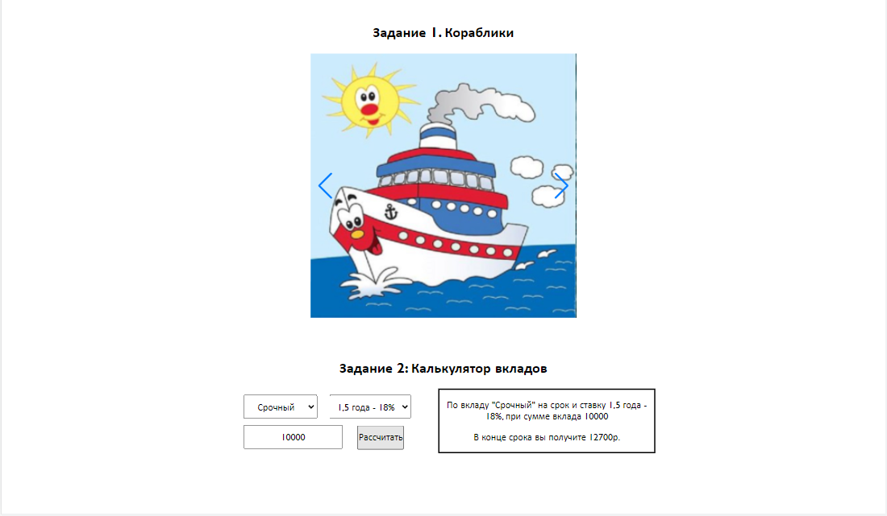
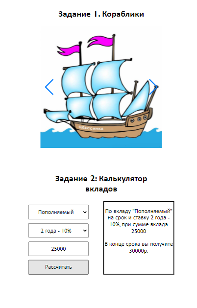

# lab2_web
# Лабораторная работа №2
## Основы git и JS

### Инструкция по запуску проекта:
1) Убедиться в наличии интернет-соединения
2) Сделать git clone репозитория
3) Перейти на ветку main
4) Открыть файл index.html

### Скриншоты компьютерной версии

### Скриншоты мобильной версии

